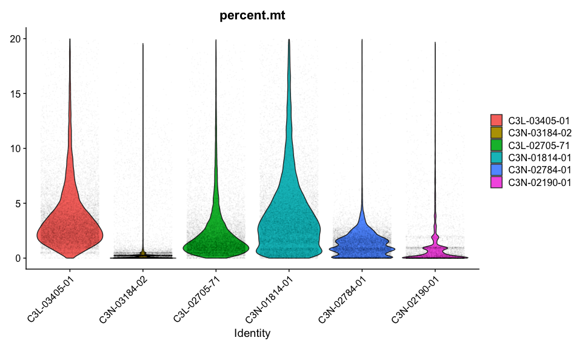
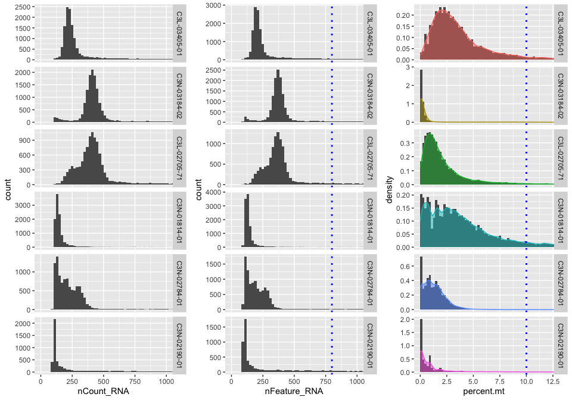
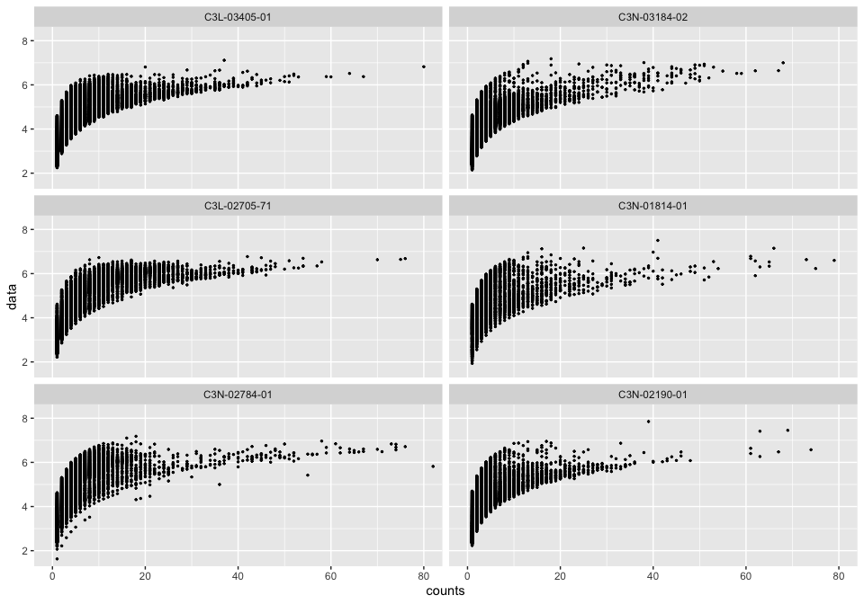
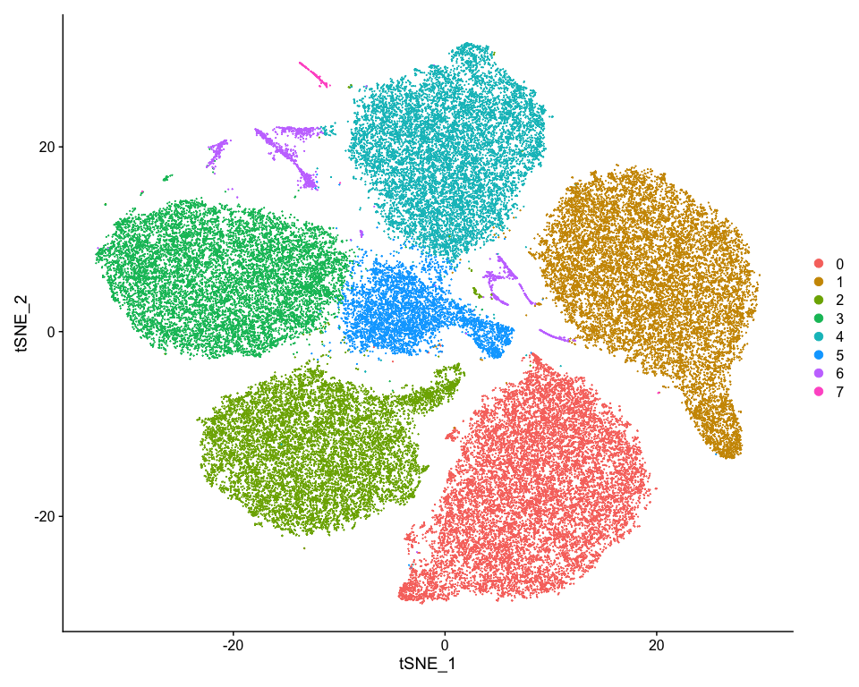

Single Cell RNA-Seq Analysis Example
================
Andrew L. Stachyra

# Objective

This is an example demonstrating basic use of the Seurat package to
analyze single cell RNA-Seq data.

# Input Data

The input data comprise [18 brain glioma
cases](https://portal.gdc.cancer.gov/repository?facetTab=files&filters=%7B%22op%22%3A%22and%22%2C%22content%22%3A%5B%7B%22op%22%3A%22in%22%2C%22content%22%3A%7B%22field%22%3A%22cases.primary_site%22%2C%22value%22%3A%5B%22brain%22%5D%7D%7D%2C%7B%22op%22%3A%22in%22%2C%22content%22%3A%7B%22field%22%3A%22files.analysis.workflow_type%22%2C%22value%22%3A%5B%22CellRanger%20-%2010x%20Raw%20Counts%22%5D%7D%7D%2C%7B%22op%22%3A%22in%22%2C%22content%22%3A%7B%22field%22%3A%22files.data_format%22%2C%22value%22%3A%5B%22mex%22%5D%7D%7D%2C%7B%22op%22%3A%22in%22%2C%22content%22%3A%7B%22field%22%3A%22files.experimental_strategy%22%2C%22value%22%3A%5B%22scRNA-Seq%22%5D%7D%7D%5D%7D)
that were downloaded from the publicly accessible “open” portion of the
TCGA repository. The actual input data files used for this analysis are
the raw transcript counts produced by the 10X Genomics Cell Ranger
workflow. Each tumor sample is represented as an *m* x *n* sparse
matrix, with gene names and/or other named transcription sites labeling
the *m* rows, and individual cell bar codes labeling the *n* columns.

In practice, the number of samples (18) is inconveniently large to
produce easily comprehensible visualizations, so for the sake of
simplicity, this analysis will only make use of the first 6 sample files
in the TCGA download package. Furthermore, the clustering analysis runs
a PCA algorithm over all cells across all samples, and as the number of
samples grows, the number of cells becomes prohibitively large for the
PCA algorithm. So in addition to limiting the number of sample files,
this analysis will also downsample across the cell bar codes as well.

# Analysis Steps

The analysis is logically divided into a series of discrete steps:

## Step 1: Load Packages and Metadata

We start by loading necessary library packages and a metadata table the
gives the correspondences between sample ID and the directory UUID where
each sample is saved.

``` r
suppressMessages(library(tidyverse))
# The %>% operator is defined by tidyverse, so we only use it after
# tidyverse is loaded
library(Seurat) %>% suppressMessages()
library(cowplot) %>% suppressMessages()

# Contains mapping between sample ID and uuid folder name
sample_sheet <- 'metadata/sample_sheet/gdc_sample_sheet.2024-01-05.tsv'
# Limit ourselves to 6 out of 18 samples, initially
smp_subset <- c('C3L-03405-01', 'C3N-03184-02', 'C3L-02705-71', 'C3N-01814-01',
                'C3N-02784-01', 'C3N-02190-01')
smpsht <- read_delim(sample_sheet, delim='\t',
                     show_col_types=FALSE) %>%
          filter(`Sample ID` %in% smp_subset)
```

## Step 2: Read Sample Files Into A List of Seurat Objects

Next, we read the data into a list of Seurat objects. Unfortunately, we
have to throw away 4/5 of cells, because the data scaling step that
happens later on is extremely memory intensive, and R will run out of
memory unless we limit the size of the input data.

``` r
sobj <- list()
for(ii in 1:nrow(smpsht)) {
  # Data from TCGA unpacks into a directory structure which follows the
  # pattern: <uuid_folder>/raw_feature_bc_matrix/
  infolder <- paste0('data/', deframe(smpsht[ii,"File ID"]),
                     '/raw_feature_bc_matrix')
  inmtx <- Read10X(infolder)
  # Slice only every 5th column in order to limit the size of the input data
  inmtx <- inmtx[,seq(5,ncol(inmtx),5)]
  # Include a row for each feature (where "feature" typically means a known
  # gene name or a named transcription site) only if there are non-zero
  # transcript count values occurring in at least 30 cell columns.  Likewise,
  # include each barcoded cell column only if there are non-zero transcript
  # counts corresponding to at least 100 unique features in that column.
  # Omit warning about substituting illegal underscores with dashes.
  sobj[[ii]] <- CreateSeuratObject(counts=inmtx, min.cells=30,
                                   min.features=100) %>%
                suppressWarnings()
  # Add an identifier to the newly created Seurat object labeling the sample
  # ID that this data came from.  We need this later for keeping track of
  # what data came from where in the merged Seurat object.  First line
  # stores the label in a dedicated object attribute named "active.ident".
  # However, this attribute can be overwritten by later function calls, so
  # the second line writes it into the metadata table as well.
  Idents(sobj[[ii]]) <- deframe(smpsht[ii,"Sample ID"])
  sobj[[ii]][["Sample_ID"]] <- Idents(sobj[[ii]])
}
```

## Step 3: Merge Seurat Objects and Calculate Mitochondrial Gene Percentage

Ultimately we want to analyze all of the data together, so we merge it
into a single Seurat object. Individual cells that have an excessively
high fraction of their transcripts arising from mitochondrial genes are
presumed to have something wrong with them, so we calculate this
fraction for each cell, to enable filtering later.

``` r
# Merge the individual sample objects into one merged object. Ignore warning
# about needing to append a suffix in order to distinguish duplicated barcode
# IDs across multiple samples. 
mrgobj <- merge(x=sobj[[1]], y=sobj[2:length(sobj)]) %>%
          suppressWarnings()
rm(sobj)
# Calculate the percentage of features which are mitochondrial genes
# identified as gene names starting with prefix "MT-"
mrgobj[["percent.mt"]] <- PercentageFeatureSet(mrgobj, pattern="^MT-")
```

## Step 4: Visualize QC Information

Seurat includes a handy `VlnPlot()` convenience function for making
violin plots, however there’s a [newly emerging school of
thought](https://youtu.be/_0QMKFzW9fw?si=-wXHFk2LJDEfQzBe) that argues
old-fashioned histograms are better at doing what violin plots were
originally supposed to achieve.

I’ll demonstrate the use of the `VlnPlot()` function briefly here, and
then show `ggplot2` histograms for comparison:

``` r
# The number of cells included in these assays is very large, so make the
# individual data points nearly transparent at alpha=0.02.  Clip the y-axis
# at 20%, so we can zoom into the busiest and most detailed region of the plot
VlnPlot(mrgobj, features=c("percent.mt"), alpha=0.02, layer="counts",
        y.max=20)
```

    ## Warning: Removed 925 rows containing non-finite values (`stat_ydensity()`).

    ## Warning: Removed 925 rows containing missing values (`geom_point()`).

<!-- -->

And here’s the same data in the right-most figure column below, but
plotted using `geom_histogram()`. Additionally, the `nCount_RNA` and
`nFeature_RNA` values are also included in the left and middle columns,
as these are computed by Seurat anyway by default. Seurat offers the
capability to use these statistics as QC cutoff thresholds, but it’s not
exactly clear what fundamentally drives the range of values that we
observe, so although I’ve included blue dotted vertical lines to suggest
where reasonable cutoff threshold values might be placed, I’ve tried to
be conservative in my approach to throwing away data, and set those
cutoffs rather loosely.

``` r
# Grab the metadata data frame
df <- mrgobj@meta.data
plt <- list()
plt[["ncount"]] <- ggplot(data=df, aes(x=nCount_RNA)) +
                   geom_histogram(boundary=0, binwidth=20) +
                   facet_grid(rows=vars(Sample_ID), scales="free_y") +
                   coord_cartesian(xlim=c(0,1000))
plt[["nfeat"]] <- ggplot(data=df, aes(x=nFeature_RNA)) +
                  geom_histogram(boundary=0, binwidth=20) +
                  facet_grid(rows=vars(Sample_ID), scales="free_y") +
                  geom_vline(xintercept=800, color="blue", linetype="dotted",
                             linewidth=1) +
                  coord_cartesian(xlim=c(0,1000))
plt[["mt"]] <- ggplot(data=df, aes(x=percent.mt)) +
               geom_histogram(aes(y=after_stat(density)), boundary=0, binwidth=0.2) +
               geom_density(aes(color=Sample_ID, fill=Sample_ID),
                            alpha=0.5, bw=0.2) +
               facet_grid(rows=vars(Sample_ID), scales="free_y") +
               geom_vline(xintercept=10, color="blue", linetype="dotted",
                          linewidth=1) +
               coord_cartesian(xlim=c(0,12)) +
               theme(legend.position="none")
cwplt <- plot_grid(plt[["ncount"]], plt[["nfeat"]], plt[["mt"]], ncol=3,
                   rel_widths=c(0.333, 0.333, 0.333))
print(cwplt)
```

<!-- -->
One thing that immediately stands out about the above data is that the
typical number of transcript counts (left column) across all six samples
is usually only slightly larger than the number of features with
non-zero count values (middle column). This means that most features
(i.e., gene transcript locations) will usually exhibit either zero or
one counts per cell. This suggests we’re losing significant fidelity in
terms of which transcripts are being expressed inside each individual
cell: many cells will register a “0” across multiple transcripts that
were actually being expressed within that cell, simply because the
genomic coverage per cell was not sufficient to get all transcripts that
were actually present up to the minimum observable count value of “1”.

The scatter plot below illustrates the relationship between the number
of features and the number of counts observed in each cell. It’s
approximately a 1-to-1 relationship; i.e., if a feature is observed in
any given cell, most of the time it has just one transcript count
associated with it.

``` r
plt_fvsc <- FeatureScatter(mrgobj, feature1="nFeature_RNA",
                           feature2="nCount_RNA") +
            scale_x_continuous(trans='log10') +
            scale_y_continuous(trans='log10') +
            coord_fixed(ratio=1)
print(plt_fvsc)
```

<!-- -->

## Step 5: Apply QC Thresholds and Normalize Count Data

The QC thresholds defined above allow us to discard “outlier” cells in
which something abnormal may be happening either with the cell itself,
or with the assay procedure. After unwanted cells are discarded, the
count data in each cell is normalized so that individual cells have
approximately equal effective weight, in terms of the total number of
transcripts per cell.

``` r
mrgobj <- subset(mrgobj, subset = nFeature_RNA < 800 & percent.mt < 10)
mrgobj <- NormalizeData(mrgobj, verbose=FALSE)
```

## Step 6: Find Variable Feaures

Some transcript products are produced in approximately equal number
throughout the different cell types, and some are highly variable
depending upon cell type. The ones which are the most variable are the
most useful for telling different cell types apart. We use functions
provided by Seurat to identify the most variable ones and visualize the
variance of their distribution across different cell types.

``` r
# Find variable features, accepting default parameters to control the operation
# of the algorithm.
mrgobj <- FindVariableFeatures(mrgobj, nfeatures=2000, verbose=FALSE)
# VariableFeatures() is the default function the Seurat docs recommend for
# obtaining a list of the top 10 most variable features.  However, it sometimes
# returns a different list than the HVFInfo() function, which is what the
# VariableFeaturePlot() function uses internally for figuring out where to
# plot the points.  So we comment it out and use HVFInfo() instead in order
# to maintain consistency.
# top10 <- head(VariableFeatures(mrgobj), 10)
top10 <- HVFInfo(mrgobj, status=TRUE) %>%
         filter(variable==TRUE & rank<=10) %>%
         rownames()
pltfeatvar <- VariableFeaturePlot(mrgobj) %>%
              LabelPoints(points=top10, repel=TRUE, xnudge=0, ynudge=0)
print(pltfeatvar)
```

    ## Warning: Removed 5442 rows containing missing values (`geom_point()`).

<!-- -->

## Step 7: Dimensionality Reduction

Later in the analysis, we’d like to identify clusters of cells with
similar feature values (i.e., similar transcript expression levels),
however we have thousands of features to choose from, and that’s too
many. To overcome this problem, we use Principal Components Analysis to
identify linear combinations of features (a.k.a., the “principal
components”) with the highest variance, ranking these in order of their
variance, then we select a much smaller subset of the principal
components to be treated as synthetic features which will be used as
input for the clustering algorithm.

``` r
# PCA works best with rescaled data
mrgobj <- ScaleData(mrgobj, features=rownames(mrgobj), verbose=FALSE)
# Here it's slightly unclear whether we should use the VariableFeatures()
# function, or the alternative technique with HVFInfo() that was previously
# illustrated above.
mrgobj <- RunPCA(mrgobj, features=VariableFeatures(object=mrgobj),
                 verbose=FALSE)
ElbowPlot(mrgobj)
```

<!-- -->

## Step 8: Cluster the Cells

It’s presumed that cells with similar transcript expression profiles
will usually correspond to the same tissue type, so that if a sample
contains multiple types of cells, we can potentially identify each cell
type by assigning each cell to a cluster ID, and identifying biomarkers
in each cluster that are known to be associated with a specific tissue
type.

In practice, we do this by finding the “nearest neighbors” of each
barcoded cell as defined by of a reduced feature set consisting of the
largest *n* PCA components. Groups of cells that are close together in
PCA feature space are then assigned together to the same cluster ID.

Unfortunately, however, the *n* PCA components that are used to
calculate nearest neighbor distances are still too high-dimensional to
visualize, therefore we use another algorithm (e.g., UMAP, or tSNE) to
project from *n* dimensions down into two dimensions. The results are
then visualized using the `DimPlot()` function.

The `resolution` parameter controls the propensity to aggregate cells
into more or fewer clusters; I was unsure of what value to choose, so I
just fiddled with it manually until the resulting cluster divisions
depicted in the UMAP and tSNE plots looked approximately like what I
would be tempted to produce if I were drawing estimated cluster
boundaries by hand.

``` r
# Find neighbors using first 10 PCA components, and identify clusters
mrgobj <- FindNeighbors(mrgobj, dims=1:10, verbose=FALSE) %>%
          FindClusters(resolution=0.1, verbose=FALSE)
# Run UMAP and TSNE, just to compare results
mrgobj <- RunUMAP(mrgobj, dims=1:10, verbose=FALSE) %>% suppressWarnings() %>%
          RunTSNE(dims=1:10, verbose=FALSE)
# Visualize output results
DimPlot(mrgobj, reduction="umap")
```

<!-- -->

``` r
DimPlot(mrgobj, reduction="tsne")
```

<!-- -->

In many single cell RNA-seq analyses, it’s typically presumed that each
cluster is associated with a specific cell type: i.e., one cluster
represents epithelial cells, another cluster represents a specific type
of immune cell, etc.

In this analysis, something unexpected seems to have happened. Each of
the 6 panels below represents one of the six sample files. The 8
color-coded bars represent the 8 clusters identified previously above.
The height of each bar represents the total number of cells in each
sample that were assigned to each cluster. If the cluster IDs were
representing different types of cells, then we’d expect that each sample
would have some cells assigned to each cluster. However, that doesn’t
seemed to have happened in this case; instead, each sample ID appears to
map almost purely onto one cluster. Cluster 0 is essentially synonymous
with sample ID `C3N-03184-02`, cluster 1 is essentially synonymous with
sample ID `C3L-03405-01`, and so on. Evidently, the sample-to-sample
variability in expression profiles is larger than the cell-type to
cell-type variability in expression profile within each sample.

``` r
# Grab metadata data frame again
df <- mrgobj@meta.data
plt_smpvscl <- ggplot(df) +
               geom_bar(aes(x=seurat_clusters, fill=seurat_clusters)) +
               facet_wrap(~Sample_ID, nrow=3)
print(plt_smpvscl)
```

<!-- -->

## Step 9: Differential Expression

Many single cell RNA-seq analyses would use differential expression
analysis at this point to try to generate an expression profile for each
cluster, by assigning “biomarkers” (essentially, identifying a set of
anomalously overexpressed transcripts) in each cluster. These biomarkers
are then thought to be useful in identifying the type of cell
represented by each cluster (e.g., red blood cells vs. neurons
vs. immune cells, etc.)

In this case, given we’ve concluded above that each cluster identified
in our clustering analysis just identifies a specific sample, we can’t
do that. Instead, a differential expression analysis just gives the
unique average expression signature associated with each tumor sample.

``` r
# Required step in order to run FinaAllMarkers()
mrgobj <- JoinLayers(mrgobj)
# Find all positive biomarkers for each cluster
allmrk <- FindAllMarkers(mrgobj, only.pos=TRUE) %>%
          suppressMessages()
# The above list is typically prohibitively long to try to visualize, so
# cut it down to 10 biomarkers per cluster
top10 <- group_by(allmrk, cluster) %>%
         filter(avg_log2FC > 1) %>%
         slice_head(n=10) %>%
         ungroup()
# Make a heatmap that shows expression level vs. cell ID vs. biomarker vs.
# cluster ID
plt_diffexp <- DoHeatmap(mrgobj, features=top10$gene) +
               scale_fill_viridis_c() %>%
               suppressWarnings()
```

    ## Scale for fill is already present.
    ## Adding another scale for fill, which will replace the existing scale.

``` r
print(plt_diffexp)
```

<!-- -->
